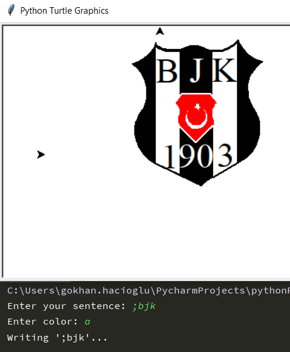

# clerk-turtle-py
A program writing what your wanted sentence with Python and Turtle library.

Codes:

import turtle
from turtle import Turtle

# forward pen
def f(i):
    t.fd(i)

# backward pen
def b(i):
    t.bk(i)

sentence = input("Enter your sentence: ")
sentence.upper()
color = input("Enter color: ")
t = Turtle()
t.penup()
t.speed(1)
t.setposition(-300, 0)

def a_letter():

    t.pendown()
    t.lt(65)
    f(11)
    t.rt(130)
    f(11)
    b(4)
    t.rt(115)
    f(5)
    t.penup()
    b(10)
    t.rt(180)
    f(2.5)
    t.rt(90)
    f(4)
    t.lt(90)

def b_letter():

    t.pendown()
    t.lt(90)
    f(10)
    t.rt(90)
    for i in range(6):
        f(1.5)
        t.rt(30)
    t.rt(180)
    for i in range(6):
        f(1.5)
        t.rt(30)
    f(3)
    t.penup()
    b(5)
    t.rt(180)
    f(5)

def c_letter():

    f(8)
    t.pendown()
    t.lt(180)
    for i in range(6):
        f(3)
        t.rt(30)
    f(3)
    t.penup()
    f(5)
    t.rt(90)
    f(11)
    t.lt(90)

def d_letter():

    t.pendown()
    t.lt(90)
    f(10)
    t.rt(90)
    f(2)
    for i in range(6):
        f(3)
        t.rt(30)
    f(5)
    t.penup()
    t.rt(180)
    f(13.5)

def e_letter():

    t.pendown()
    f(5)
    b(5)
    t.lt(90)
    f(10)
    t.rt(90)
    f(5)
    b(5)
    t.rt(90)
    f(5)
    t.lt(90)
    f(5)
    t.penup()
    f(5)
    t.rt(90)
    f(5)
    t.lt(90)
    t.penup()

def f_letter():

    t.pendown()
    t.lt(90)
    f(10)
    t.rt(90)
    f(5)
    b(5)
    t.rt(90)
    f(5)
    t.lt(90)
    f(5)
    t.penup()
    f(5)
    t.rt(90)
    f(5)
    t.lt(90)
    t.penup()

def g_letter():

    f(10)
    t.lt(90)
    f(5)
    t.lt(90)
    f(5)
    t.rt(180)
    f(2)
    t.pendown()
    for i in range(6):
        f(1.5)
        t.rt(30)
    f(2)
    for i in range(6):
        f(3)
        t.rt(30)
    f(7)
    t.penup()
    f(5)
    t.rt(90)
    f(10)
    t.lt(90)

def h_letter():

    t.pendown()
    t.lt(90)
    f(10)
    b(5)
    t.rt(90)
    f(5)
    t.lt(90)
    f(5)
    b(10)
    t.rt(90)
    t.penup()
    f(5)

def i_letter():

    t.lt(90)
    t.pendown()
    f(10)
    b(10)
    t.penup()
    t.rt(90)
    f(5)

def j_letter():

    t.lt(90)
    f(10)
    t.rt(90)
    t.pendown()
    f(5)
    b(2.5)
    t.rt(90)
    f(8)
    for i in range(5):
        f(1)
        t.rt(36)
    t.penup()
    for i in range(5):
        b(1)
        t.lt(36)
    f(1)
    t.lt(90)
    f(7.5)

def k_letter():

    t.pendown()
    t.lt(90)
    f(10)
    b(5)
    t.rt(45)
    f(7)
    b(7)
    t.rt(90)
    f(8)
    t.penup()
    b(8)
    t.rt(45)
    f(5)
    t.lt(90)
    f(10)

def l_letter():

    t.pendown()
    t.lt(90)
    f(10)
    b(10)
    t.rt(90)
    f(5)
    t.penup()
    f(5)

def m_letter():

    t.pendown()
    t.lt(90)
    f(10)
    t.rt(135)
    f(5)
    t.lt(90)
    f(5)
    t.rt(135)
    f(10)
    t.penup()
    t.lt(90)
    f(5)

def n_letter():

    t.pendown()
    t.lt(90)
    f(10)
    t.rt(135)
    f(14)
    t.lt(135)
    f(10)
    t.penup()
    b(10)
    t.rt(90)
    f(5)

def o_letter():

    f(5)
    t.pendown()
    for i in range(10):
        f(4)
        t.lt(36)
    t.penup()
    f(15)

def p_letter():

    t.pendown()
    t.lt(90)
    f(10)
    t.rt(90)
    for i in range(6):
        f(1.5)
        t.rt(30)
    f(1)
    t.penup()
    b(1)
    for i in range(6):
        b(1.5)
        t.lt(30)
    t.rt(90)
    f(10)
    t.lt(90)
    f(5)

def r_letter():

    t.pendown()
    t.lt(90)
    f(10)
    t.rt(90)
    for i in range(6):
        f(1.5)
        t.rt(30)
    f(1)
    t.lt(135)
    f(7)
    t.penup()
    t.lt(45)
    f(5)

def s_letter():

    t.pendown()
    f(1)
    for i in range(6):
        f(1.5)
        t.lt(30)
    for i in range(6):
        f(1.5)
        t.rt(30)
    f(4)
    t.penup()
    t.rt(90)
    f(11)
    t.lt(90)
    f(5)

def t_letter():

    t.lt(90)
    f(10)
    t.rt(90)
    t.pendown()
    f(5)
    b(2.5)
    t.rt(90)
    f(10)
    t.penup()
    t.lt(90)
    f(10)

def u_letter():

    t.lt(90)
    f(10)
    t.rt(180)
    t.pendown()
    f(7)
    for i in range(5):
        f(2)
        t.lt(36)
    f(10)
    t.penup()
    b(12)
    t.rt(90)
    f(5)

def v_letter():

    t.lt(90)
    f(10)
    t.rt(150)
    t.pendown()
    f(13)
    t.lt(115)
    f(13)
    t.penup()
    t.lt(35)
    b(10)
    t.rt(90)
    f(5)

def y_letter():

    f(5)
    t.lt(90)
    t.pendown()
    f(6)
    t.rt(45)
    f(4)
    b(4)
    t.lt(90)
    f(4)
    b(4)
    t.rt(45)
    b(6)
    t.rt(90)
    t.penup()
    f(10)

def z_letter():

    t.pendown()
    f(5)
    b(5)
    t.lt(65)
    f(12)
    t.rt(65)
    b(5)
    t.rt(90)
    t.penup()
    f(11)
    t.lt(90)
    f(10)

def x_letter():

    t.pendown()
    t.lt(45)
    f(14)
    t.rt(135)
    t.penup()
    f(10)
    t.rt(135)
    t.pendown()
    f(14)
    t.penup()
    t.rt(45)
    b(10)
    t.rt(90)
    f(15)

def q_letter():

    f(5)
    t.pendown()
    for i in range(10):
        f(4)
        t.lt(36)
    t.penup()
    f(10)
    t.rt(45)
    t.pendown()
    b(7)
    f(5)
    t.lt(45)
    t.penup()
    f(5)

def w_letter():

    t.pendown()
    t.lt(90)
    f(10)
    b(10)
    t.rt(45)
    f(5)
    t.rt(90)
    f(5)
    t.lt(135)
    f(10)
    b(10)
    t.penup()
    t.rt(90)
    f(5)

def one_number():

    t.pendown()
    t.lt(90)
    f(10)
    t.lt(135)
    f(4)
    b(4)
    t.rt(135)
    b(10)
    t.rt(90)
    t.penup()
    f(5)

def two_number():

    t.pendown()
    f(8)
    b(8)
    t.lt(45)
    f(5)
    for i in range(6):
        if i == 5:
            t.penup()
        f(3.5)
        t.lt(37.5)
    f(11)
    t.lt(90)
    f(17)

def three_number():

    t.pendown()
    f(2)
    for i in range(6):
        f(2)
        t.lt(30)
    f(3)
    t.rt(180)
    for i in range(6):
        f(2)
        t.lt(30)
    f(3)
    t.penup()
    t.lt(90)
    f(15)
    t.lt(90)
    f(14)

def four_number():

    f(5)
    t.lt(90)
    t.pendown()
    f(10)
    t.lt(135)
    f(7)
    t.lt(135)
    f(9)
    t.rt(90)
    t.penup()
    f(5)
    t.lt(90)
    f(5)

def five_number():

    t.pendown()
    f(2)
    for i in range(6):
        f(2)
        t.lt(30)
    f(4)
    t.rt(90)
    f(4)
    t.rt(90)
    f(6)
    t.rt(90)
    t.penup()
    f(12)
    t.lt(90)
    f(7)

def six_number():

    t.pendown()
    for i in range(10):
        f(2)
        t.lt(36)
    t.lt(135)
    for i in range(5):
        f(4)
        t.rt(27)
    t.penup()
    t.rt(90)
    f(16)
    t.lt(90)
    f(8)

def seven_number():

    t.lt(70)
    t.pendown()
    f(11)
    t.lt(110)
    f(5)
    t.lt(90)
    t.penup()
    f(10)
    t.lt(90)
    f(10)

def eight_number():

    t.pendown()
    for i in range(10):
        f(0.5)
        t.lt(13.5)
    f(3)
    for i in range(10):
        f(0.5)
        t.rt(13.5)

    for i in range(10):
        f(0.5)
        t.rt(13.5)
    f(5)
    for i in range(10):
        f(0.5)
        t.lt(13.5)
    t.penup()
    f(10)

def nine_number():

    t.lt(45)
    t.pendown()
    f(7)
    for i in range(10):
        f(2)
        t.lt(31.5)
    f(3)
    t.rt(90)
    t.penup()
    f(5)
    t.lt(90)
    f(8)

def zero_number():

    t.pendown()
    for i in range(5):
        f(1)
        t.lt(18)
    f(8)
    for i in range(5):
        f(1)
        t.lt(18)
    for i in range(5):
        f(1)
        t.lt(18)
    f(8)
    for i in range(5):
        f(1)
        t.lt(18)
    t.penup()
    f(10)

def dot():

    t.dot(3)
    f(5)

def exclamation():

    t.dot(3)
    t.lt(90)
    f(4)
    t.pendown()
    f(6)
    t.penup()
    b(10)
    t.rt(90)
    f(5)

def question():

    t.dot(3)
    t.lt(90)
    f(4)
    t.pendown()
    f(2)
    t.rt(90)
    for i in range(8):
        f(2)
        t.lt(36)
    t.penup()
    t.rt(18)
    f(9)
    t.lt(90)
    f(15)

def comma():

    t.pendown()
    t.dot(3)
    t.rt(45)
    for i in range(15):
        f(0.4)
        t.rt(10)
    t.penup()
    for i in range(15):
        b(0.4)
        t.lt(10)
    t.lt(45)
    f(5)

print("Writing '" + sentence + "'...")

try:

    t.pencolor(color)
except:

    t.pencolor('black')

if sentence == ";bjk":

    import turtle_bjk_logo
elif sentence == ";motherland":

    import turtle_tr_flag
elif sentence == ";btc":

    import turtle_bitcoin
else:

    for i in range(len(sentence)):
        if sentence[i] == "A" or sentence[i] == "a":
            a_letter()
        elif sentence[i] == 'B' or sentence[i] == "b":
            b_letter()
        elif sentence[i] == 'C' or sentence[i] == "c" or sentence[i] == "ç" or sentence[i] == "Ç":
            c_letter()
        elif sentence[i] == 'D' or sentence[i] == "d":
            d_letter()
        elif sentence[i] == 'E' or sentence[i] == "e":
            e_letter()
        elif sentence[i] == 'F' or sentence[i] == "f":
            f_letter()
        elif sentence[i] == 'G' or sentence[i] == "g" or sentence[i] == 'Ğ' or sentence[i] == "ğ":
            g_letter()
        elif sentence[i] == 'H' or sentence[i] == "h":
            h_letter()
        elif sentence[i] == 'I' or sentence[i] == "i" or sentence[i] == "ı" or sentence[i] == "İ":
            i_letter()
        elif sentence[i] == 'J' or sentence[i] == "j":
            j_letter()
        elif sentence[i] == 'K' or sentence[i] == "k":
            k_letter()
        elif sentence[i] == 'L' or sentence[i] == "l":
            l_letter()
        elif sentence[i] == 'M' or sentence[i] == "m":
            m_letter()
        elif sentence[i] == 'N' or sentence[i] == "n":
            n_letter()
        elif sentence[i] == 'O' or sentence[i] == "o" or sentence[i] == "ö" or sentence[i] == "Ö":
            o_letter()
        elif sentence[i] == 'P' or sentence[i] == "p":
            p_letter()
        elif sentence[i] == 'R' or sentence[i] == "r":
            r_letter()
        elif sentence[i] == 'S' or sentence[i] == "s" or sentence[i] == "ş" or sentence[i] == "Ş":
            s_letter()
        elif sentence[i] == 'T' or sentence[i] == "t":
            t_letter()
        elif sentence[i] == 'U' or sentence[i] == "u" or sentence[i] == "ü" or sentence[i] == "Ü":
            u_letter()
        elif sentence[i] == 'V' or sentence[i] == "v":
            v_letter()
        elif sentence[i] == 'Y' or sentence[i] == "y":
            y_letter()
        elif sentence[i] == 'Z' or sentence[i] == "z":
            z_letter()
        elif sentence[i] == ' ':
            f(10)
        elif sentence[i] == '.':
            dot()
        elif sentence[i] == ',':
            comma()
        elif sentence[i] == '!':
            exclamation()
        elif sentence[i] == '?':
            question()
        elif sentence[i] == 'X' or sentence[i] == "x":
            x_letter()
        elif sentence[i] == 'Q' or sentence[i] == "q":
            q_letter()
        elif sentence[i] == 'W' or sentence[i] == "w":
            w_letter()
        elif sentence[i] == '1':
            one_number()
        elif sentence[i] == '2':
            two_number()
        elif sentence[i] == '3':
            three_number()
        elif sentence[i] == '4':
            four_number()
        elif sentence[i] == '5':
            five_number()
        elif sentence[i] == '6':
            six_number()
        elif sentence[i] == '7':
            seven_number()
        elif sentence[i] == '8':
            eight_number()
        elif sentence[i] == '9':
            nine_number()
        elif sentence[i] == '0':
            zero_number()
f(10)
t.write("     ->" + sentence)
print("Done.")

turtle.mainloop()
